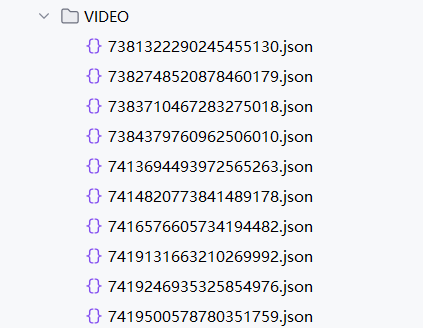
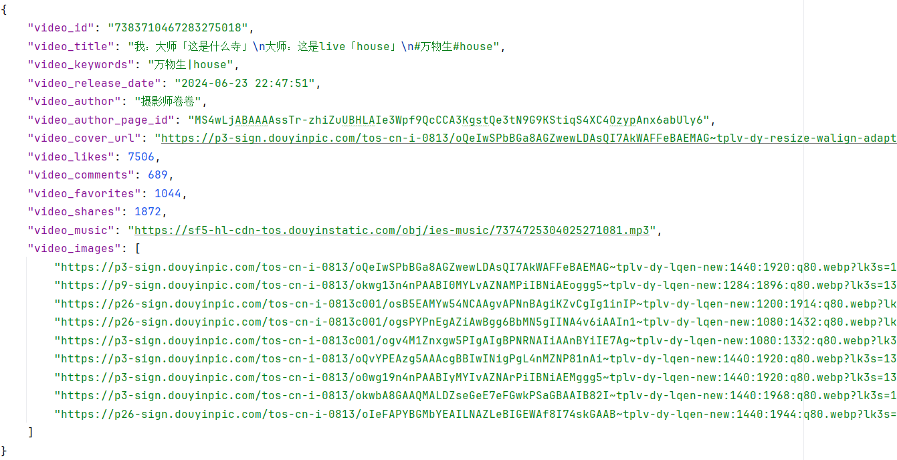
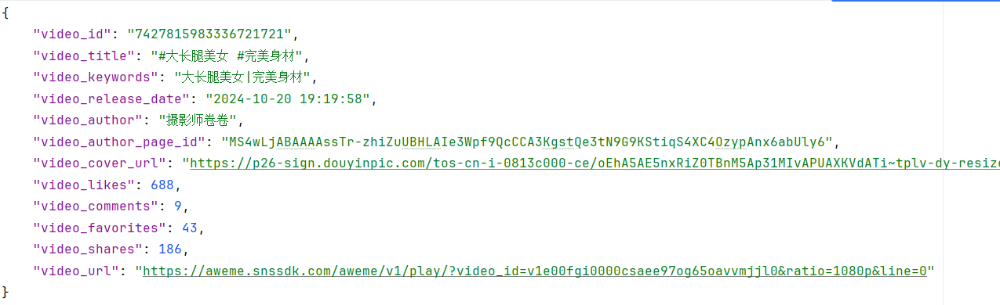

# 获取抖音网页版所有个人作品数据

## <1> 运行 video-id.py
 输入主页链接和 **cookie**

运行结果
  
会在当前目录下生成一个 **video-id.txt** 文件

## <2> 运行 crawl.py
会在当前目录下生成 VIDEO 文件夹，其中保存着所有视频的 JSON 数据

如果视频为图片视频，则：

其中 **video_music** 为视频的背景音乐， **video_images** 为 **URL**

其它则为：

其中 **video_url** 为视频的 **URL**，已默认为 **1080p**

其中可自定义获取的视频数据，修改视频 **id** 列表即可

***
# 本代码仅作为学习与科研用处，切勿用于违法行为
***

